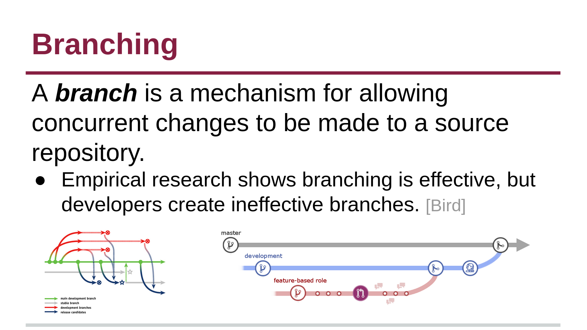
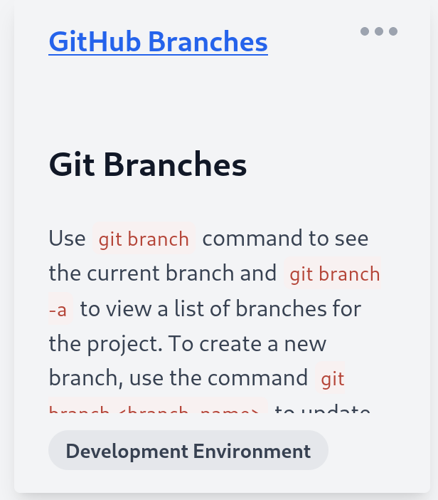

# Branching

_Branches_ are simply pointers to commits in git.

More broadly, branches provide isolated development work environments that do not impact the main source code. _Merging_ is the process of combining the work from separate branches. Branches are useful for developing features, fixing bugs, organizing work, safely experimenting with the project in a contained area, or contributing to other repositories (i.e. branching is recommended as a good practice for submitting pull requests). Check out the following notebook to practice branching with git.

### 📒 Online Exercise

__Click the preview below to visit the test exercise. This activity will open in the same tab, so make sure to navigate back here.__

Use `git branch` to see the current branch and `git branch -a` to view a list of branches for the project.

## 📝 Activity: Creating Branches on a Repo

For this activity, you will work with your pair programming partner to create branches on a repository. Please complete the following steps:

1. One partner should create an empty GitHub repository named PairProgramming. Set the repository description to be something about "CS5704 Software Engineering Coding Environments Workshop". Update the README to contain both partners names and a description of the pair programming activity.
2. Both partners should then clone the created repository and create a new branch. The branch should be named your student ID (i.e. dcbrown).
3. Add your individual `Roman.<ext>` files to your specific branch. Push these changes to your remote repository.
4. Locally, change back to the main branch and add your changes and push. This will probably lead to a **merge conflict**, since at least one member of your team will have an outdated version. This is a common part of merging and programming in teams.
5. Fix or avoid the merge conflict to create a combined `Roman.<ext>` file with both methods and comments created by students in _one file_. Push this to the main branch along with your branches.txt file.
6. Add the instructor (chbrown13) and TA (marnaoty) to be collaborators to your repository.

## [Package Managers ⏭️](Install.md)