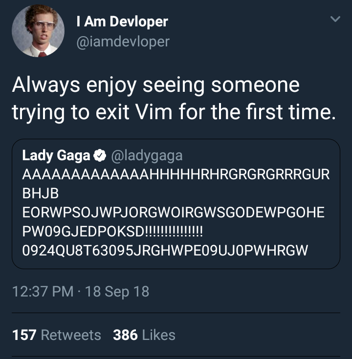
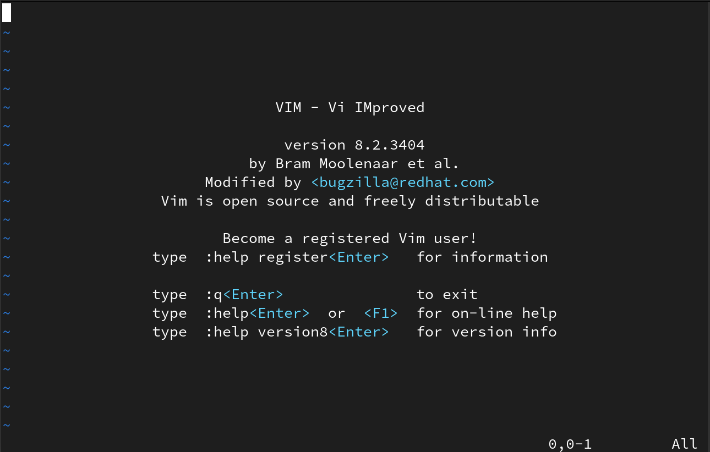

# Integrated Development Environments

Integrated Development Environments (IDEs) enable software engineers to complete various activities related to writing a computer program. IDEs often provide a variety of features to support software development, including syntax highlighting, autocomplete, static analysis tools, debugging functionality, refactoring, multiple language support, integrations with git, code searching, and more...

Originally, software engineers wrote program code using [punch cards](https://en.wikipedia.org/wiki/Punched_card) in languages such as FORTRAN. Before the modern coding editors and cloud-based IDES, software engineers wrote code using editors in the console or terminal. One example is `vi`, an open source terminal-based development environment referred to as "[the programmer's editor](https://www.vim.org/about.php)". It is a common joke in software engineering communities that `vi` is difficult to exit out of...

In this activity, you will get the chance to try a few out for yourself.

## 📒 Online Exercise: Introduction to IDEs

**There will be _two_ screenshots to submit for this activity! Add them to the main branch of your workshop repository. Click on the image below to continue:**

## [Metrics ⏭️](Metrics.md)