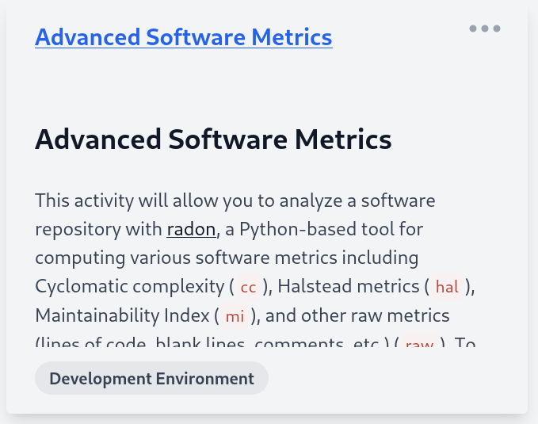

# Software Metrics

This activity will allow you to practice using various tools to calculate various code metrics discussed in class. To submit this assignment, answer all of the questions below in a .txt or .pdf file to submit on Canvas. Pay attention to activities completed on your local machine (_you should have installed a package manager on your machine in the previous notebook_) or on Docable.

### Exercise: Lines of Code

`sloc` is a basic tool that counts [source lines of code](https://www.npmjs.com/package/sloc). Install the `sloc` package on to your system:

`npm install -g sloc`

> Alternatively, you can use Count Lines of Code (`cloc`) on Chocolatey: [https://chocolatey.org/packages/CLOC](https://chocolatey.org/packages/CLOC)

To run these tools, simply open a command-line and type:

```cloc <file-name>``` / ```sloc <file-name>``` 

to count the number of lines in a specific file or

```sloc .``` / ```cloc .``` 

to count the number of lines for all of the files in the current directory. More details are available using `sloc -h` or `cloc -help`. 

## 📝 Activity

**Use one of the lines of code counting tools above to complete this activity. Submit your responses to the following questions with your [Homework 3 assignment](https://canvas.vt.edu/courses/145256/assignments/1384321) on Canvas:**

* How many total lines of source code are in the `Roman.<ext>` file for your pair programming workshop repository (_main branch_)?
* How many total lines of _comments_ are in the `Roman.<ext>` file for your pair programming workshop repository (_main branch_)?
* How many total lines of code are in the `Roman.<ext>` file for _your branch_ of the pair programming workshop repository?

### 📒 Online Exercise

**Click below to check out an activity working with another tool for measuring more advanced code metrics for python. Turn in your responses to the questions with HW3 on Canvas.**


<a href="https://devops.docable.cloud/dcbrown/v/620ec3c6a42d528cf97154a5">

</a>

You completed the CS5704 Development Environments Workshop! The deliverables for this workshop include a GitHub repository (with code, two branches, a text file, and three screenshots) in addition to answers to [questions on Canvas](https://canvas.vt.edu/courses/145256/assignments/1384321) for Homework 3. If you were not able to complete the workshop in class, finish the rest for homework.

**Due:** Friday February 25 at 11:59pm on GitHub and Canvas