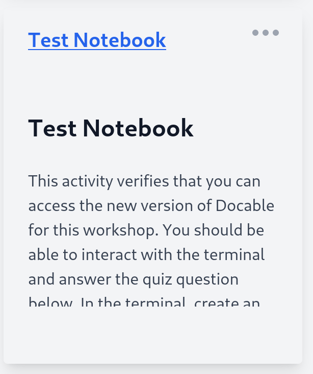

# Overview

The development environment workshop provides hands-on experience for students to learn and practice a set of relevant tools and processes used for implementing software in industry. Please read all of the instructions for each notebook carefully for information on how to complete the assignment and details on what to submit. 

You may work with a partner to complete this workshop (some activities necessitate partners), *however some tasks require your work to be submitted individually!* The workshop is contained in this repository with links to activities using an updated version of Docable. All Docable activities will be designated with (📒) and normal activities with (📝). For example:

### 📒 Online Exercise

__Click on the image below to visit a test exercise with the new version of Docable. All activities will open in the same tab by default, so make sure to navigate back here or open them in a new tab.__

If you run into any issues during the workshop, please contact the instructor.

## [Continue to the workshop ⏭️](Overview.md)

